# simplechain挖矿手册

## 1.使用Windows挖矿

### （1）使用钱包挖矿

请到下载地址....下载相应操作系统下的安装文件SimpleNode.exe，下载成功之后双击该文件，按照步骤进行安装

注：电脑上如果安装了360安全卫士等安全类软件，安装过程中会出现错误提示，把安全类软件退出就可以

安装步骤：	1).点击下一步

<div align=center>
 
</div>

​    			2).选择安装目录，点击安装


​	     		3).安装完成后，点击完成安装成功


安装成功后点击启动图标启动引用


启动过程中会同步数据，会需要一点等待时间，可以点击“跳过”


第一次进入会提示会提示创建账户，点击“创建账户”


设置密码并确认密码（!!!请务必管理好自己的密码，应用不支持找回密码服务）


点击提交，提示“恭喜您创建成功”，并可以看见自己的钱包地址（如我的地址是： 0x8416c39e6f6117b824aa379ea2f2373d527be1ec），点击“暂不备份”


进入应用主页面可以看见自己的钱包列表，和每个钱包的交易详情及备份，转账，删除等操作


点击主页面左下角的开启挖矿，在跳出页面中选择挖矿的钱包账户名称


点击提交按钮开始进行挖矿


挖矿详情弹窗，可以查看当前挖矿算力，区块高度（挖矿过程中，主页面左下角显示“挖矿中”）


之后可以将应用最小化到后台，让应用进行挖矿中

### （2）.使用sipe挖矿

请到下载地址.....下载相应操作系统下的执行程序sipe-windows-1.0.0-amd64.exe（Windows版本），下载下来放到相应目录下（我放到D:\下）

键盘上Windows+R键启动运行程序，输入cmd，点击确定，启动命令行


命令行当前目录不是我放执行文件的目录，输入d:敲回车 跳转到文件所在目录

```powershell
C:\Users\Administrator>d:
```


可以查看sipe-windows-1.0.0-amd64.exe相应的操作选项

```powershell
D:\>sipe-windows-1.0.0-amd64.exe -h
```


节点启动命令：其中，--etherbase指定挖矿钱包地址，--mine开启挖矿，--minerthreads指定挖矿进程数量，--port指定端口号， --datadir在当前目录下新创建文件夹，--ipcdisable关闭IPC服务

```powershell
D:\>sipe-windows-1.0.0-amd64.exe --etherbase 0x8416c39e6f6117b824aa379ea2f2373d5
27be1ec --mine --minerthreads 1 --port 30313 --datadir sipewa --ipcdisable
```

如果出现下图红框中的“mined potential block”，表示挖矿成功


可以通过钱包查询账户收益。


### （3）.多台电脑使用gominer挖矿

请到下载地址.....下载相应操作系统下的执行程序sipe-windows-1.0.0-amd64.exe（Windows版本），下载下来放到相应目录下（我放到D:\下），命令行启动过程参见上一节。

使用一台电脑做主节点，启动命令行添加参数'--minertype stratum'，此时启动电脑可以通过stratum协议连接该电脑一起挖矿

```powershell
D:\>sipe-windows-1.0.0-amd64.exe --etherbase 0x8416c39e6f6117b824aa379ea2f2373d5
27be1ec --mine --minerthreads 1 --port 30313 --datadir sipewa --ipcdisable --minertype stratum
```

当出现下图中情况，说明主节点已经启动，开始在挖矿了


请到下载地址https://github.com/simplechain-org/gominer/releases下载相应操作系统下的执行程序gominer-windows-1.0.0-amd64.exe（Windows版本），下载下来放到相应目录下（我放到D:\下）

可以查看gominer-windows-1.0.0-amd64.exe相对应的操作选项

```powershell
D:\>gominer-windows-1.0.0-amd64.exe -h
```


使用如下命令连接主节点一同挖矿

```powershell
D:\>gominer-windows-1.0.0-amd64.exe --stratumserver 192.168.9.224:8801 --minername 1
 --stratumpasswd 1
```


主节点可以看见该节点连人的日志


钱包账户余额又增加了


##2.使用Mac挖矿

###（1）.使用钱包挖矿

请到下载地址…….下载相应操作系统下的安装程序SimpleNode，

安装成功后点击启动图标

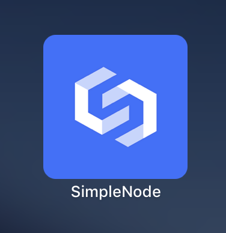

启动中，会同步数据，可以点击“跳过”

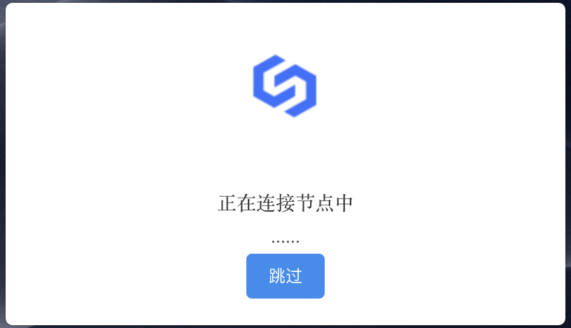

第一次进入会提示创建账户，点击“创建账户”

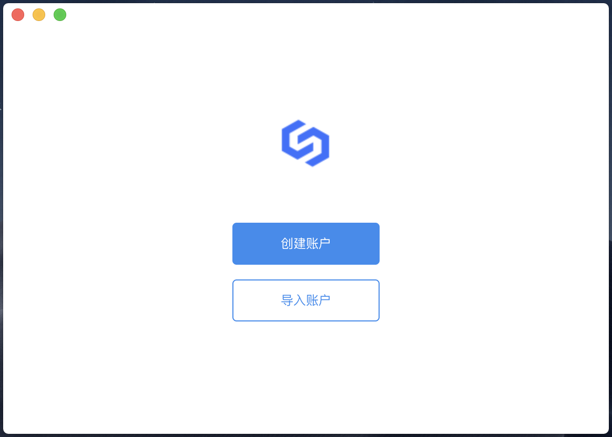

设置密码，并确认密码(!!!请务必管理好自己的密码，应用不支持找回密码服务)

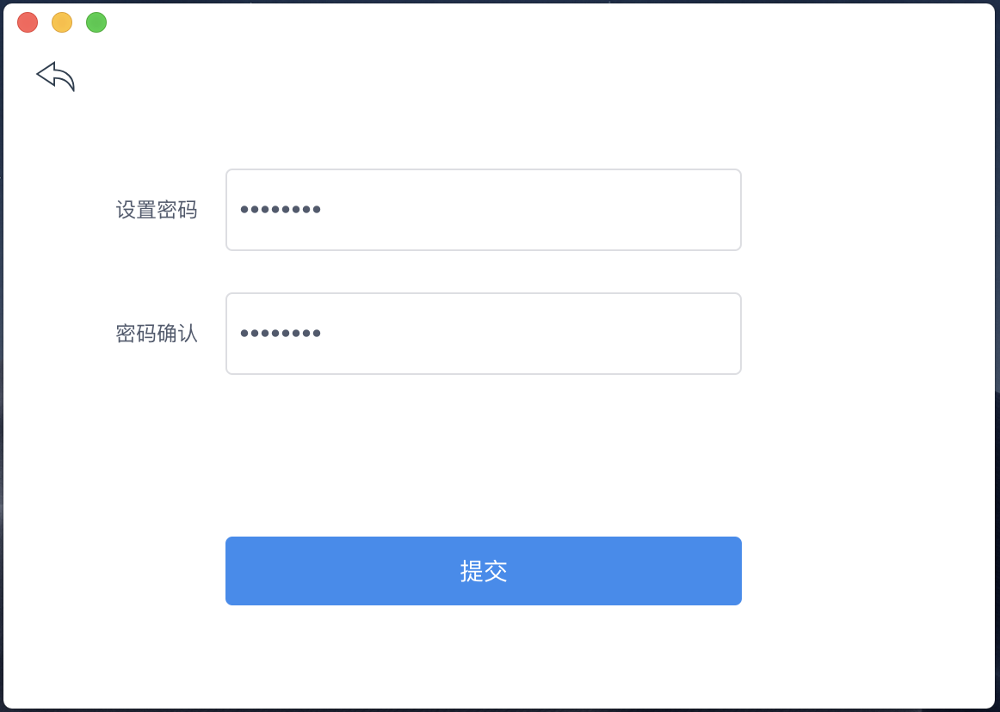

提示“恭喜您创建成功”，并可以看见自己的钱包地址，（例如我的钱包地址是:0x15e8982630b52fb36739fcc10a217a460465a5ac），点击“暂不备份”

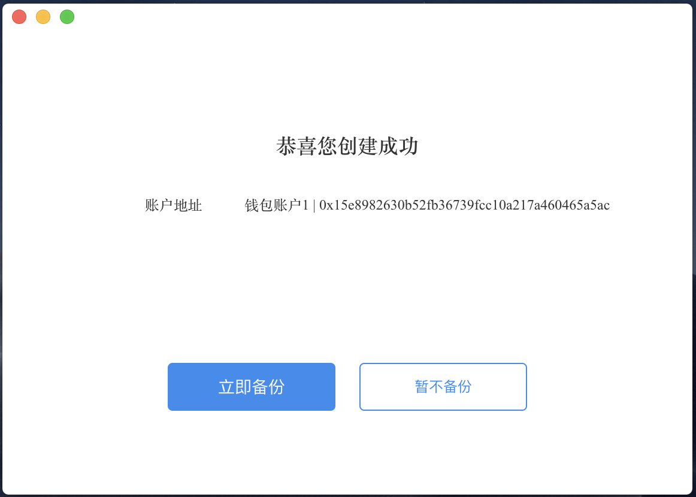

进入主界面可以看见自己的钱包列表，和每个钱包的交易详情

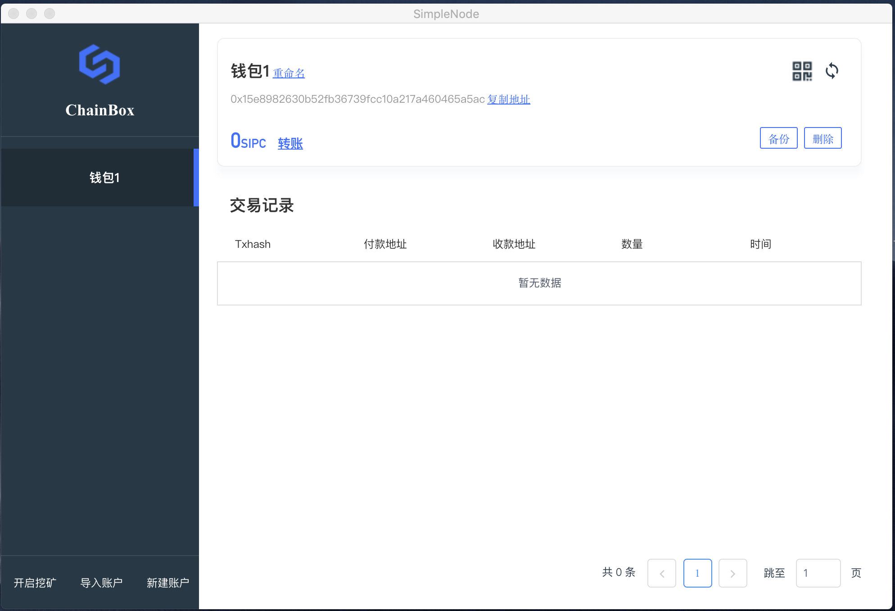

点击主界面左下角的“开启挖矿”，并选择挖矿账户，点击“提交”

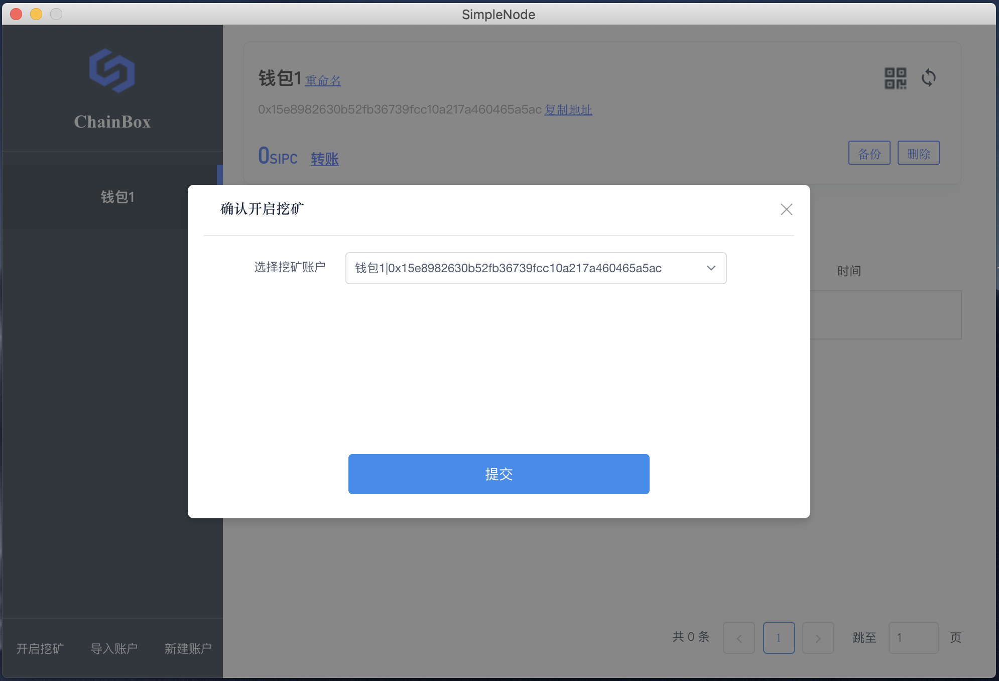

提示挖矿详情，可以看到当前区块高度和自己的挖矿算力

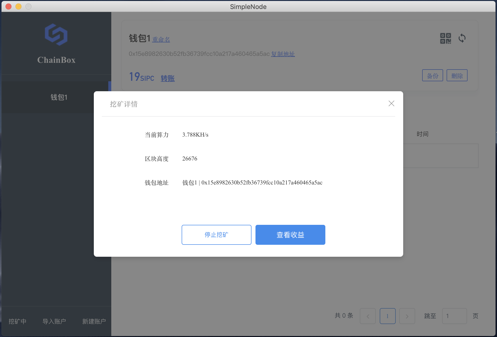

之后可以将程序最小化到后台，等待挖矿成功。

###（2）.使用sipe挖矿

请到下载地址https://github.com/simplechain-org/go-simplechain/releases下载相应操作系统下的执行程序sipe-darwin-1.0.0-amd64（Mac版本）

添加可执行权限

```shell
yusheng@qkl:~/Downloads$ chmod +x sipe-darwin-1.0.0-amd64
```

可以查看sipe-darwin-1.0.0-amd64相应的操作选项

```shell
yusheng@qkl:~/Downloads$ ./sipe-darwin-1.0.0-amd64 -h
```

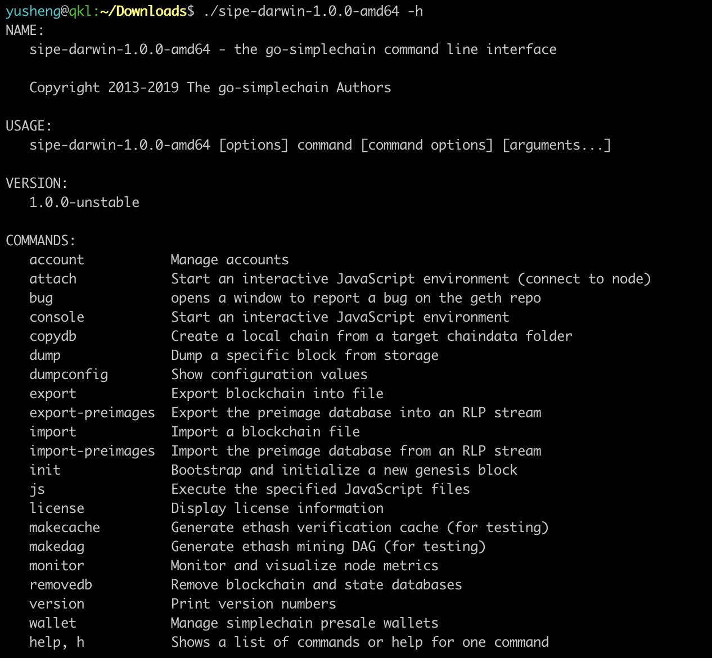

节点启动命令，其中，—etherbase指定您的钱包地址，--mine开启挖矿，--minerthreads 指定挖矿进程数量

```shell
yusheng@qkl:~/Downloads$ ./sipe-darwin-1.0.0-amd64 --etherbase 0x15e8982630b52fb36739fcc10a217a460465a5ac --mine --minerthreads 1 
```

如果提示错误信息：“Fatal: Error starting protocol stack: listen udp :30312: bind: address already in use”，请添加参数 '--port 30313'；

如果提示如下图的“🔨 mined potential block”，表示挖矿成功。

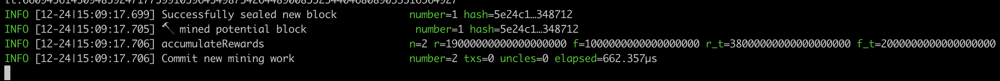

可以通过钱包查询账户收益。

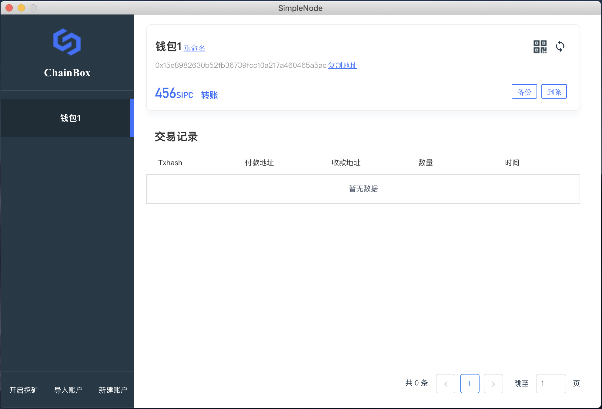

###（3）.多台电脑使用gominer挖矿

使用一台电脑做主节点，启动命令添加参数'--minertype stratum'，此时启动电脑可以通过stratum协议连接该电脑一同挖矿

```shell
yusheng@qkl:~/Downloads$ ./sipe-darwin-1.0.0-amd64 --etherbase 0x15e8982630b52fb36739fcc10a217a460465a5ac --mine --minerthreads 1 --minertype stratum
```

请到下载地址https://github.com/simplechain-org/gominer/releases下载相应操作系统下的执行程序gominer-darwin-1.0.0-amd64（Mac版本）

添加可执行权限

```shell
yusheng@qkl:~/Downloads$ chmod +x gominer-darwin-1.0.0-amd64
```

可以查看gominer-darwin-1.0.0-amd64相应的操作选项

```shell
yusheng@qkl:~/Downloads$ ./gominer-darwin-1.0.0-amd64 -h
```

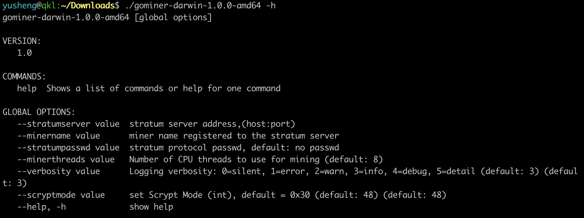

使用如下命令连接主节点一同挖矿

```shell
yusheng@qkl:~/Downloads$ ./gominer-darwin-1.0.0-amd64 --stratumserver 192.168.2.189:8801 --minername 1 --stratumpasswd 1
```

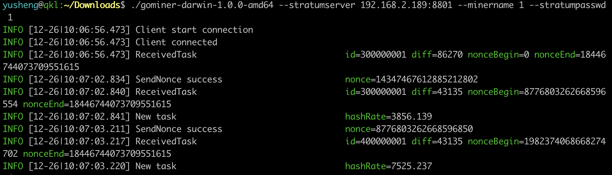

主节点可以看见该节点连人的日志


钱包中账户收益又增加了！

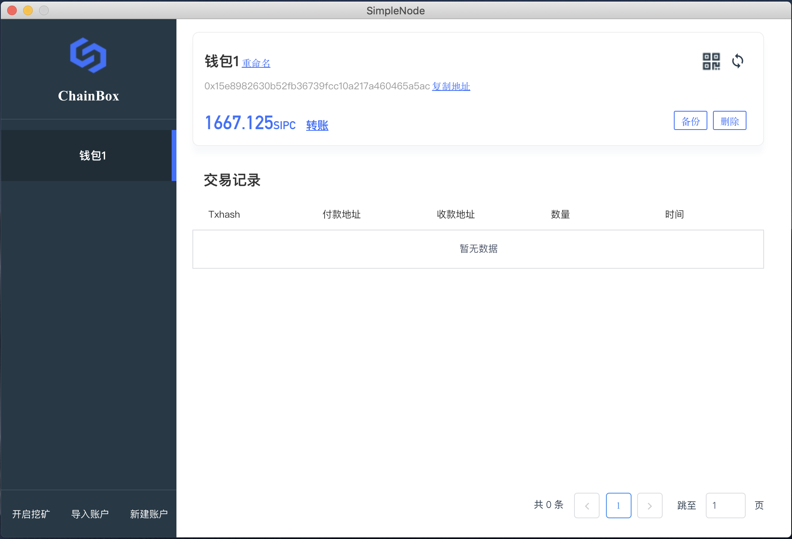


##1.使用Ubuntu挖矿

### （1）.使用钱包挖矿

请到下载地址…….下载相应操作系统下的安装程序SimpleNode-0.0.14.tar.gz

解压文件

```shell
yu@qkl:~/Downloads$ tar zxvf SimpleNode-0.0.14.tar.gz
```

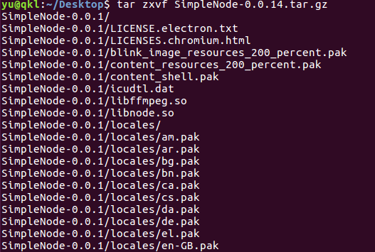

点击解压文件夹中如下图标启动应用

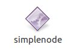

启动比较缓慢，耐心等待后，会出现如下提示创建账户的界面，点击“创建账户”

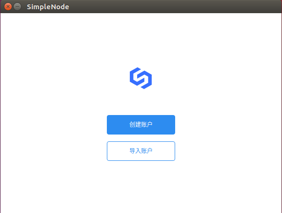

设置密码，并确认密码(!!!请务必管理好自己的密码，应用不支持找回密码服务)

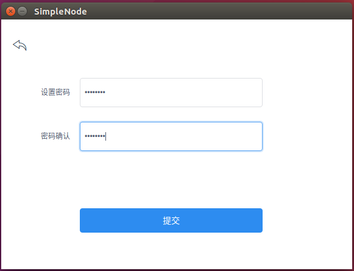

提示“恭喜您创建成功”，并可以看见自己的钱包地址，（例如我的钱包地址是:0x22040901ebb616a9f6920920f4777e7503082e6），点击“暂不备份”

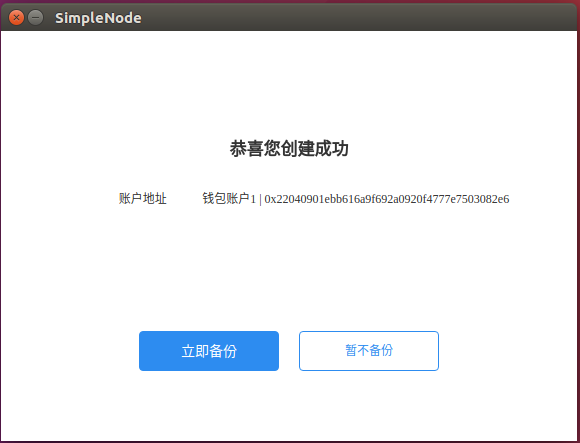

进入主界面可以看见自己的钱包列表，和每个钱包的交易详情

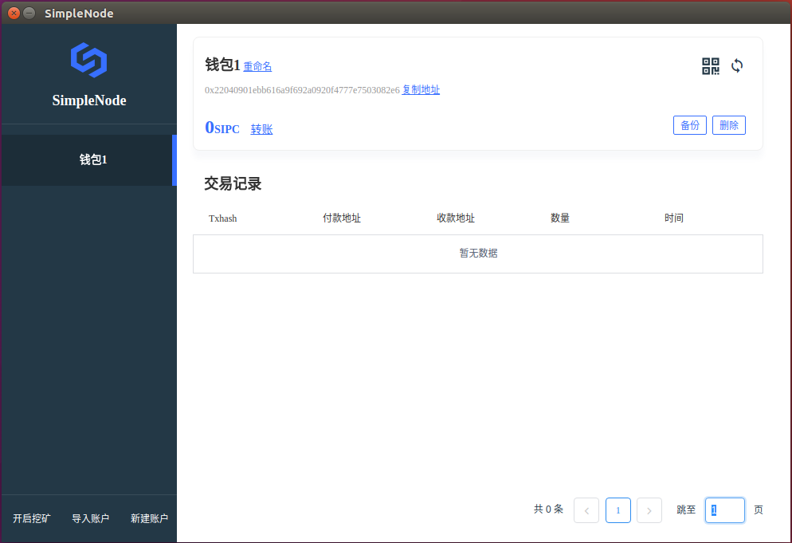

点击主界面左下角的“开启挖矿”，并选择挖矿账户，点击“提交”

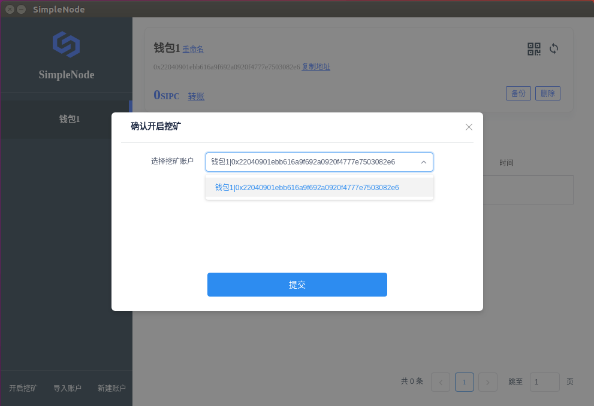

提示挖矿详情，可以看到当前区块高度和自己的挖矿算力

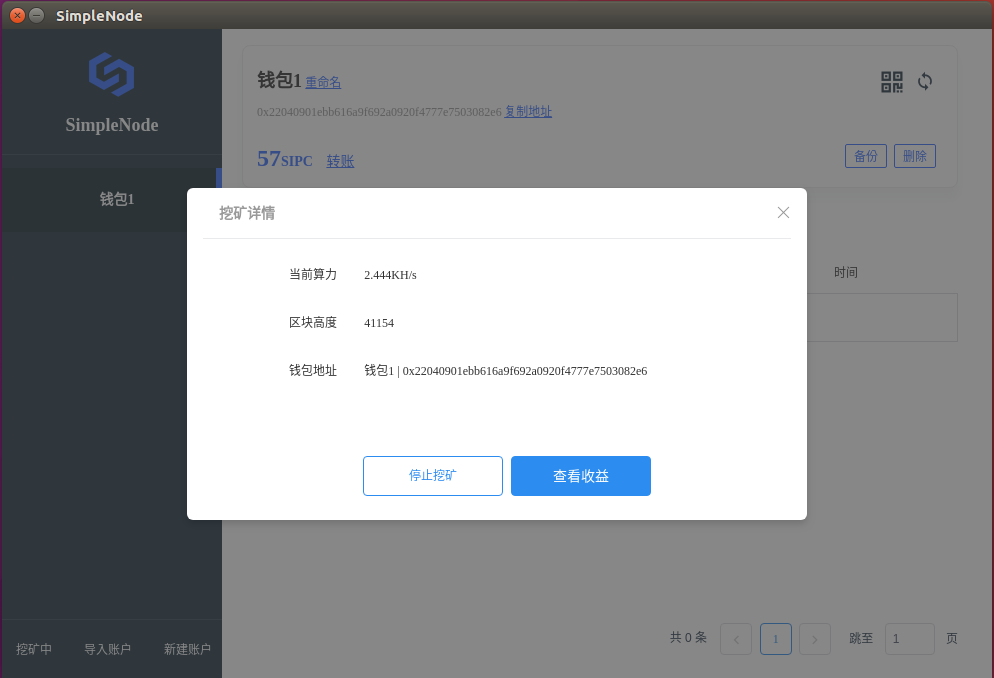

之后可以将程序最小化到后台，等待挖矿成功。

### （2）.使用sipe挖矿

请到下载地址https://github.com/simplechain-org/go-simplechain/releases下载相应操作系统下的执行程序sipe-linux-1.0.0-amd64（Mac版本）

添加可执行权限

```shell
yu@qkl:~/Downloads$ chmod +x sipe-linux-1.0.0-amd64
```

可以查看sipe-linux-1.0.0-amd64相应的操作选项

```shell
yu@qkl:~/Downloads$ ./sipe-linux-1.0.0-amd64 -h
```

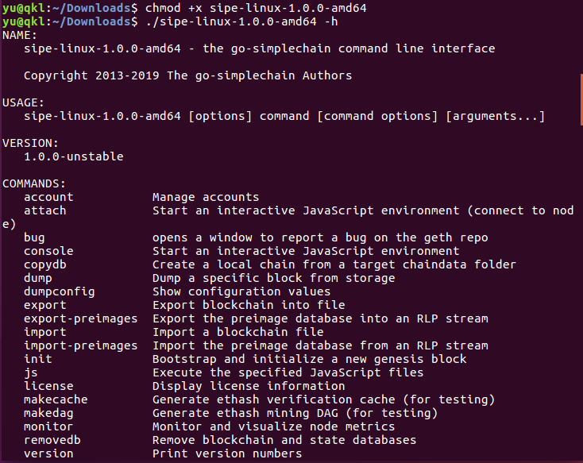

节点启动命令，其中，—etherbase指定您的钱包地址，--mine开启挖矿，--minerthreads 指定挖矿进程数量

```shell
yu@qkl:~/Downloads$ ./sipe-darwin-1.0.0-amd64 --etherbase 0x22040901ebb616a9f6920920f4777e7503082e6 --mine --minerthreads 1 
```

如果提示错误信息：“Fatal: Error starting protocol stack: listen udp :30312: bind: address already in use”，请添加参数 '--port 30313'；

如果提示如下图的“🔨 mined potential block”，表示挖矿成功。


可以通过钱包查询账户收益。

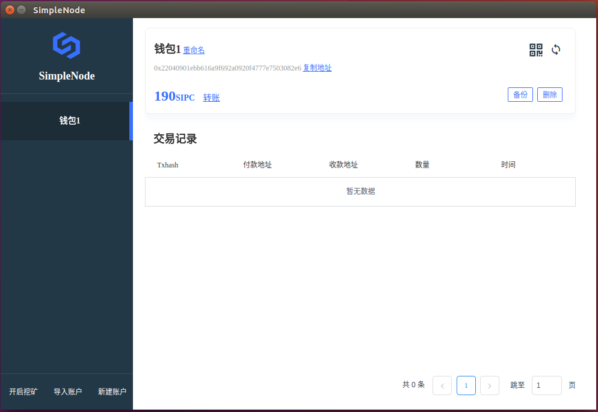

### （3）.多台电脑使用gominer挖矿

使用一台电脑做主节点，启动命令添加参数'--minertype stratum'，此时启动电脑可以通过stratum协议连接该电脑一同挖矿

```shell
yu@qkl:~/Downloads$ ./sipe-linux-1.0.0-amd64 --etherbase 0x15e8982630b52fb36739fcc10a217a460465a5ac --mine --minerthreads 1 --minertype stratum
```

请到下载地址https://github.com/simplechain-org/gominer/releases下载相应操作系统下的执行程序gominer-linux-1.0.0-amd64（Mac版本）

添加可执行权限

```shell
yu@qkl:~/Downloads$ chmod +x gominer-linux-1.0.0-amd64
```

可以查看gominer-linux-1.0.0-amd64相应的操作选项

```shell
yu@qkl:~/Downloads$ ./gominer-linux-1.0.0-amd64 -h
```


使用如下命令连接主节点一同挖矿

```shell
yu@qkl:~/Downloads$ ./gominer-linux-1.0.0-amd64 --stratumserver 192.168.2.189:8801 --minername 1 --stratumpasswd 1
```

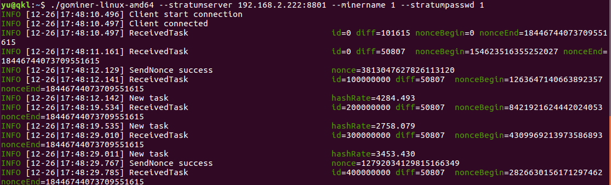

主节点可以看见该节点连人的日志


钱包中账户收益又增加了！


